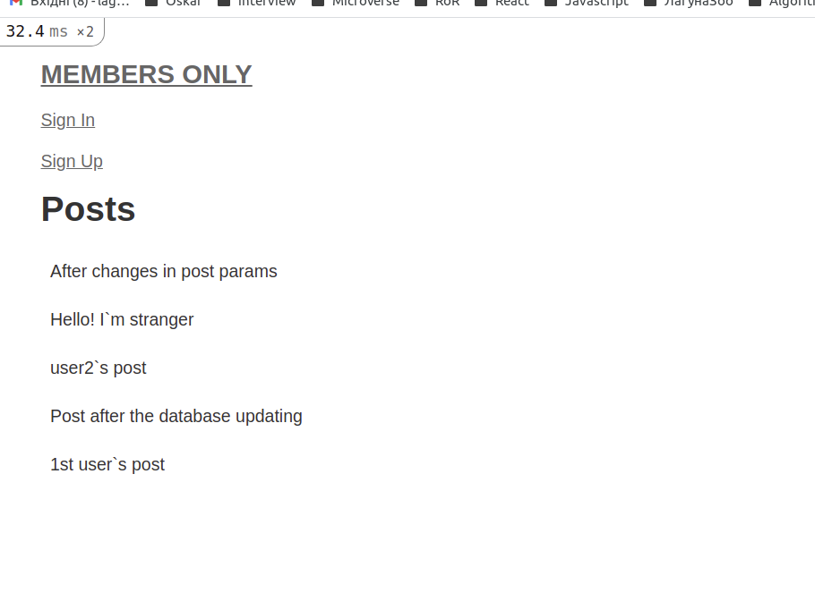
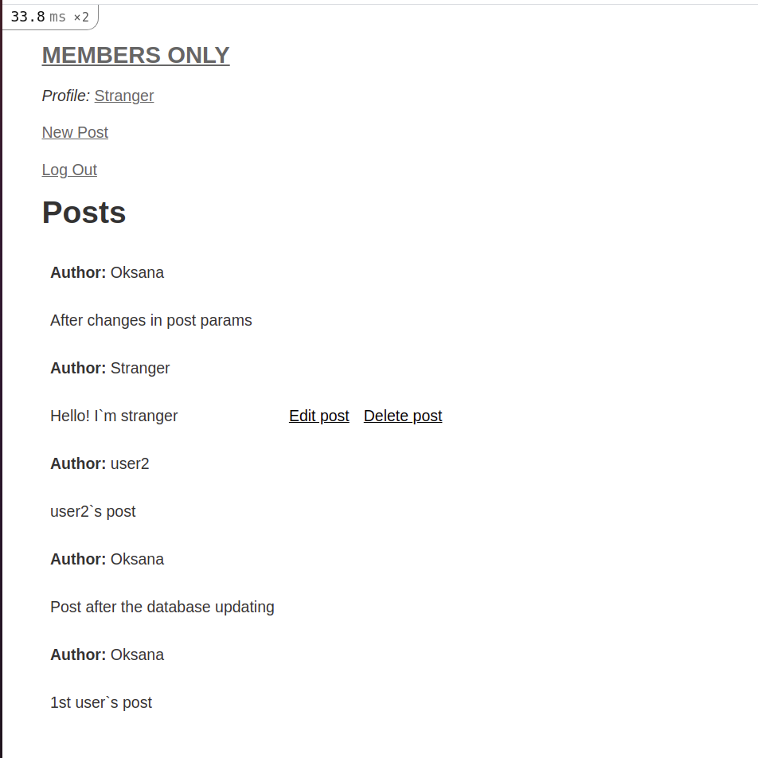

# README
In this project I`m working to implement authentication systems so users can only access areas of a site they are authorized to.
* User can:
- create an account
- create post
* Only registered or logged in users can see the post`s author name.

The project right now built without CSS styles.

This README would normally document whatever steps are necessary to get the
application up and running.

Things you may want to cover:

* Ruby version
2.7.2

* Rails version
6.1.4.1

